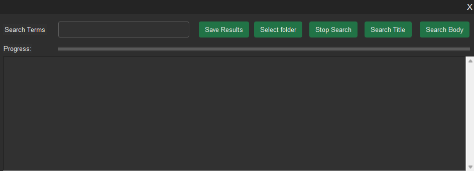

# pdf-organizer

## Description
This python based application allows the user to search within a directory for all PDF documents that contain a given term. The implementation of multiprocessing allows for this task to be completed efficiently, and the user-friendly menu allows the user to configure the search appropriately, and store the results for future use.

## Installation
The application is compatible with Windows based systems. There are two main ways to run the application, either by running the python script, or by using the precompiled executable. Note that in order to use the python script, the user must first download some necessary packages. This can be done with the following command.
```
pip install -r requirements.txt
```

## How to use
After launching the application, the user will be presented with the main screen.

The user provides the search terms, separated by commas in the "Search Terms" field.
Select a folder by clicking the "Select Folder" button. This opens the directory dialog window.
After selecting a folder to search through, click either "Search Title" or "Search Body", depending on your needs.
Please note that searching through the body of the PDF files will take considerably longer. The progress of the search 
is displayed on the "Progress" bar. You can stop the search at any time by pressing the "Stop Search" button.
The text field at the lower part of the window is used to display error and/or status messages, and the results once
they have been calculated. Once the results have been calculated, they can be stored using "Save Results". This will
create an ".xlsx" file under `My Documents/Organizer`, if it does not exist already.

## Stored Results
The results file contains the following information:
- Search Term: The search term given by the user
- Search Type: Either Body or Title
- Root Directory: The directory selected by the user to run the search
- Location: The location of the PDF file that matched the search term

## Design Principles and Optimization
The application makes use of tkinter to provide the user-friendly UI, using a customised theme. The search task is
parallelized in the following way. First, the main program receives the input search terms and the directory to search
through. The main application compiles a list of all PDF files in the directory (and any subdirectories) and splits the
list in the predefined number of parts, one for each process. The processes are then given their respective parts and
perform the search. The main process then concatenates the results.


